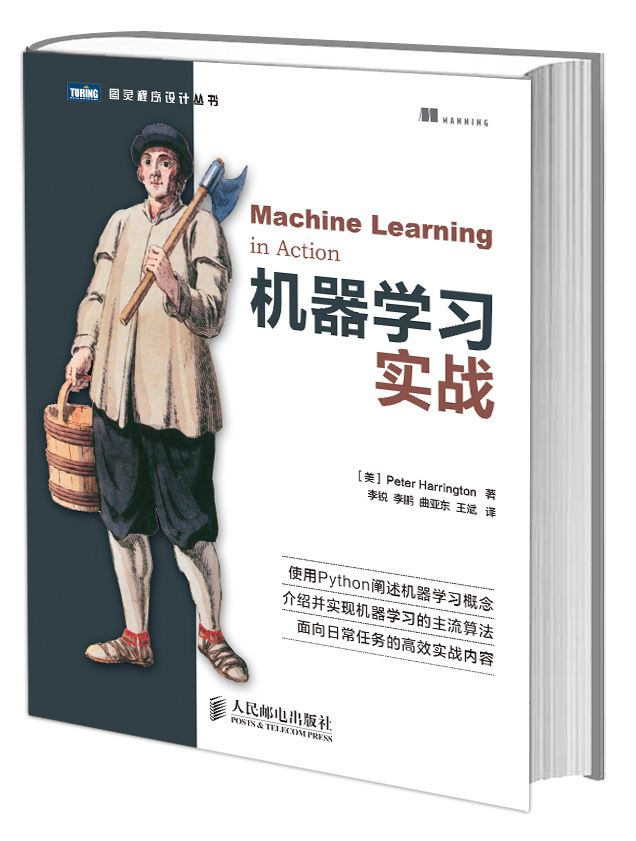
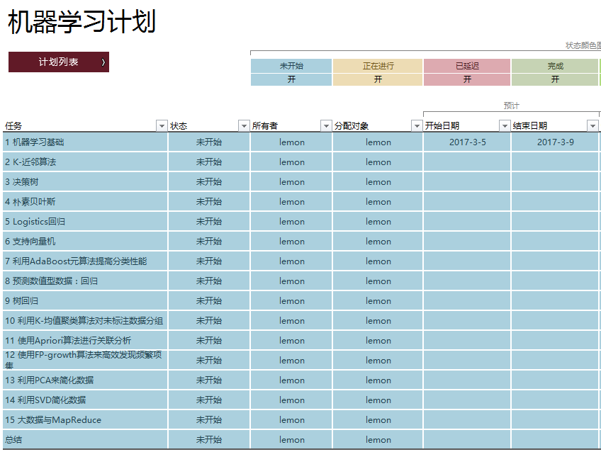
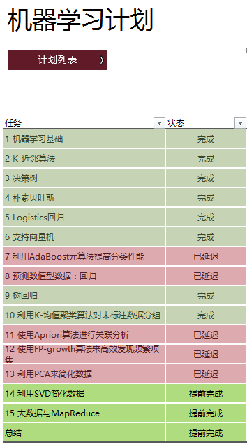

# 1 书籍阅读

《机器学习实战》（Machine Learning in Action）这本书，作者为 Peter Harrington。

在开始阅读这本书之前，做了一个简单的阅读计划，预计花 **35天** 左右的时间，自己看一遍这本书，比较有系统的学习下机器学习的相关算法原理。

**计划表格** 的格式如下：

图2：

**实际完成情况** 如下：

图3：

虽然有些章节有些延迟，但总体上还是按时完成了本书的阅读。 当然，书中还有许多疑问，有待后续继续深入了解。
